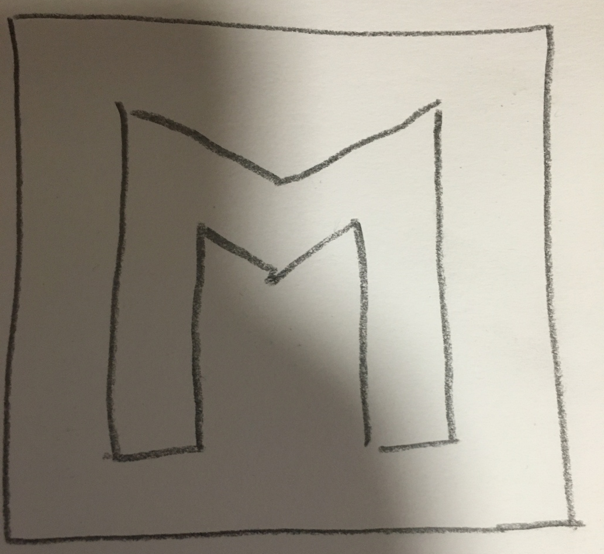
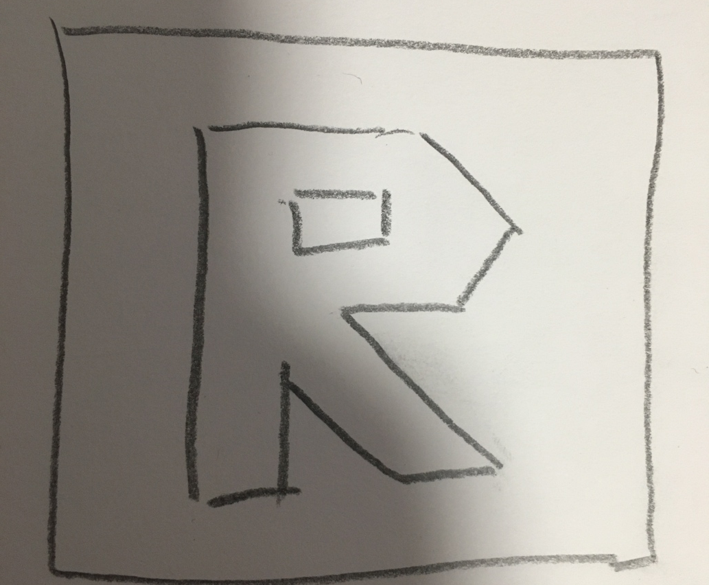
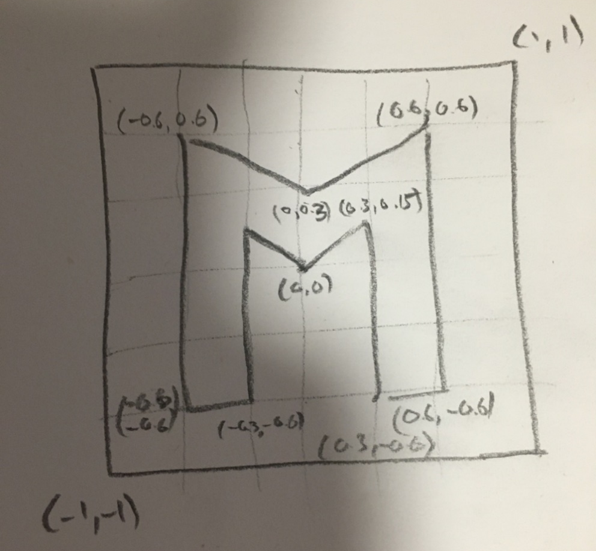

# COMP3170 - Week 2: Your first LWJGL project

For this exercise you are going to write an OpenGL program from scratch to draw a simple shape, like this:
  Haha I'm going to get you.
## Pencil and Paper

As a graphics programmer you should always carry a pencil and paper. You can save yourself a lot of time by sketching your ideas before you begin coding them. In week 1, we provided you with a grid book and a pencil. If you didn't receive this last week, let your practical demonstrator know.

While we strongly recommend sketching things out by hand, there are a few online options if you’re in a pinch and don’t have any paper handy. We’ve found these to be the best (free) tools:

* [Really Sketch:](https://reallysketch.com/app/)<br>Really Sketch gives you a webpage of virtual grid paper to sketch on. It’s simple and lightweight, and allows you to change the colour of your drawing, but erasing things can be a bit annoying.

* [Virtual Graph Paper:](https://virtual-graph-paper.com/)<br>Virtual Graph Paper is a bit more full-on than Really Sketch, and comes with more snap, guide and grid options.

* [Bamboo Paper:](https://www.wacom.com/en-au/products/apps-services/bamboo-paper)<br>Bamboo Paper is from Wacom, and is the most basic of these options, and is for Apple, Android and Windows tablets. It allows you to draw on a variety of paper types, including graph. Unlike the other options, there is no option for creating perfectly straight lines, but this does give you more freedom to figure out your ideas.

* [Geogebra:](https://www.geogebra.org/calculator)<br>Cam is a little obsessed with using Geogebra to show off vector math. It is also a good tool for creating 2D meshes, using the Polygon tools. It's getting a little bloated now, but still has some uses.

## Choosing a shape
Before you draw your shape, decide on what you want to create. Keep things simple for now - the important thing is understanding how shapes are constructed and drawn, so we recommend picking something simple to start. You can re-create your shape into something more complex later on. Here are some example shapes:


### A space ship:<br>

### A lightning bolt:<br>

### The first letter of your name:<br>

### An arrow:<br>

### An emerald:<br>

## Drawing your shape

On your graph paper, draw a square. We will treat this as the bounds of the window we are going to create. Inside this square, draw your shape like this:



You want to keep your shape blocky. If you picked something with curves, simplify them as straight lines.



For every corner (vertex) of the shape, work out appropriate coordinates in NDC space. Remember that (0,0) is the middle of the square, (-1,-1) is the bottom left and (1,1) is the top right. These don’t have to be exact, as long as they form the right shape. You can tweak them later. Label them on your drawing:
 


Divide your shape up into triangles. Try to use as few triangles as you can. These coordinates and triangles define the mesh you are going to draw.


## Creating the project

><b>Fetch latest version!</b><br>
From time-to-time, we will make updates to the comp3170-lwjgl library. It is a good idea at the start of each prac to make sure you have the latest version, and pull if you don’t.

Open up Eclipse. You should already have the package `comp3170-lwjgl` in your workspace. If not, got back to the week 1 tutorial and follow the instructions to download it.

><b>Tip: Create your project in this repo</b><br>
It isn't compulsory, but you may want to keep the work you make today bundled with this prac sheet. If so, clone this repo into your Eclipse projects folder and create your Java project inside of it.

Create a new Java project and give it a meaningful name such as comp3170-prac-week-2. 

If you have multiple JREs installed, make sure you select the right one. You also want to make sure <b>Create module-info.java file</b> is unticked.

Click Finish to create the project. 

><b>New Perspective Pop-up</b><br>
You may get a pop-up for a new perspective. This will change the Eclipse window layout to match what it thinks is ideal for this project type. If you are attached to your current layout, don’t click ‘yes’.

When you’ve created the project, the first thing you need to do is add the LWJGL project to the classpath so it can find the LWJGL library. Follow the same steps as last week to add the LWJGL library to the classpath.

## Create a Window

Create a new class in your project called Week2 and make it implement IWindowListener class.

Following the example in the live lecture, add a constructor to show the window and a main method to create an instance when the class is run. Set the size to make the window square. 

><b>Implement IWindowListener</b><br>
Eclipse will be warning you that Week2 does not meet the requirements to inherit `IWindowListener`. Tell Eclipse to add the unimplemented methods. It should add four methods: `init`, `draw`, `resize`, and `close`.

Run this and make sure the window appears. Also make sure the program exits when you close the window. 

## Clear the window

Again, following the example in the lecture, in the init method, set `glClearColor` to whatever background colour takes your fancy. 

Then in `draw`, call `glClear(GL_COLOR_BUFFER_BIT)` to clear the colour buffer to this colour. 

We also want to ensure that when we resize our window, the viewport changes as well. Add the following code to the resize method:

```
this.width = width;
this.height = height;
glViewport(0,0,width,height);
```

Run the code and check this works.

## Create the shaders and scene
Copy the two simple shaders vertex.glsl and fragment.glsl from the lecture example. You will now need to create a Scene class and compile your shaders. Check the live lecture video and code for how to do this. Here are a few things to check if you get stuck:

* Create a ShaderLibrary instance in the Week2 class, which points at the directory your shaders are saved in (hint: should just be this project!).
* Declare the shader names in the Scene class.
* Declare a Shader object in the Scene class.
* Compile the shader in the Scene class using `ShaderLibrary.instance.compileShader(VERTEX_SHADER, FRAGMENT_SHADER);`
* Create a new Scene within the Week2 class and call its `draw()` method.
* Enable the shader in the Scene class. 

## Create the vertex buffer
Create an array of floats that lists all the vertices in your shape. We’ll be using an index buffer, so you only need to list each vertex once. You can use the below example to check your code is working, but you should draw your own shape:

```
// @formatter:off
vertices = new Vector4f[] {
	new Vector4f(-0.6f,  -0.6f, 0.0f, 1.0f),	// P0
	new Vector4f(-0.3f,  -0.6f, 0.0f, 1.0f),	// P1
	new Vector4f(-0.6f,   0.6f, 0.0f, 1.0f),	// P2
	new Vector4f(-0.3f,  0.15f, 0.0f, 1.0f),	// P3
	new Vector4f( 0.0f,   0.3f, 0.0f, 1.0f),	// P4
	new Vector4f( 0.0f,   0.0f, 0.0f, 1.0f),	// P5
	new Vector4f( 0.3f,  0.15f, 0.0f, 1.0f),	// P6
	new Vector4f( 0.6f,   0.6f, 0.0f, 1.0f),	// P7
	new Vector4f( 0.6f,  -0.6f, 0.0f, 1.0f),	// P8		
	new Vector4f( 0.3f,  -0.6f, 0.0f, 1.0f),	// P9
};
// @formatter:on
```

Then call `GLBuffers.createBuffer()` to load this data into a buffer in graphics memory.

## Write an index buffer

You now need to create an index buffer that describes the triangles in your mesh, using the vertices listed above. In my code above, I added comments to list the indices for each vertex (note they start at 0). The index buffer is then a list of triangles, as triples of vertex indices:

```
// @formatter:off
indices = new int[] {
	0, 1, 3,
	0, 3, 2,
	2, 3, 4,
	3, 5, 4,
	4, 5, 7,
	4, 7, 6,
	6, 7, 8,
	8, 9, 6,	    	
};
// @formatter:on
```

Then call `GLBuffers.createIndexBuffer()` to load this data into an index buffer in graphics memory.

## Write the draw code
Now finish the `draw()` function to draw your shape. You will need to:
1.	Enable the shader.
2.	Set the `a_position` attribute to the vertex buffer you created.
3.	Set the `u_colour` uniform to the colour you want your shaoe to be.
4.	Bind the index buffer by calling `glBindBuffer()`.
5.	Draw the shape by calling `glDrawElements()`.

## Add vertex colouring
Change the code so each vertex is a different colour. To do this you will need to:
1.	Add a colour attribute to the vertex shader.
2.	Pass this value to the fragment shader in a varying.
3.	Set the output colour to the varying colour in the fragment shader.
4.	Create a buffer of vertex colours in your scene.
5.	Set the colour attribute to this colour buffer in `draw()`.

Again, check out the lecture video if you get stuck on any of these steps.

## To receive a mark for today, show your tutor:
* Your sketch of your mesh on paper or a digital drawing tool.
* Your LWJGL code.
* Your LWJGL program running, drawing your shape.

## Challenge – Colour gradient

Instead of using vertex colours, rewrite the shaders to create a colour gradient depending on the fragment position, e.g. from bottom to top, or left to right. Like this:


 
The GLSL (Not Java!) function [mix()](https://registry.khronos.org/OpenGL-Refpages/gl4/html/mix.xhtml) can be useful here.
<br>
<br>
<br>
<br><br><br><br><br><br><br><br><br><br><br><br><br><br><br><br><br><br><br><br><br><br><br><br><br><br><br><br><br><br><br><br><br><br><br><br><br><br><br><br><br><br><br><br><br><br><br><br><br><br><br><br><br><br><br><br><br><br><br><br><br><br><br><br><br><br><br><br><br><br><br><br><br><br><br><br><br><br><br><br><br><br><br><br><br><br><br><br><br><br><br><br><br><br><br><br><br><br><br><br><br><br><br><br><br><br><br><br><br><br><br><br><br><br><br><br><br><br><br><br><br><br><br><br><br><br><br><br><br><br><br><br><br><br><br><br><br><br><br><br><br><br><br><br><br><br><br><br><br><br><br><br><br><br><br><br><br><br><br><br><br><br><br><br><br><br><br><br><br><br><br><br><br><br><br><br><br><br><br><br><br><br><br><br><br><br><br><br><br><br><br><br><br><br><br><br><br><br><br><br><br><br><br><br><br><br><br><br><br><br><br><br><br><br><br><br><br><br><br><br><br><br><br><br><br><br><br><br><br><br><br><br><br><br><br><br><br><br><br><br><br><br><br><br><br><br><br><br><br><br><br><br><br><br><br><br><br><br><br><br><br><br><br><br><br><br><br><br><br><br><br><br><br><br><br><br><br><br><br><br><br><br><br><br>

<center>


</center>